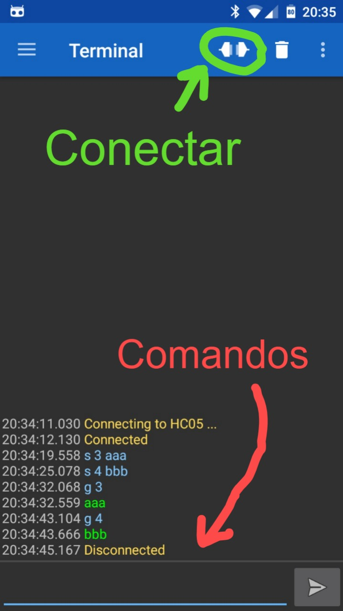

# Experimentos SERVOMEC 1  

Experimentos por aulas:  

1. [Controle bang-bang](./aula1)
2. Sintonia PID com Ziegler-Nichols
3. Controle de velocidade

## Instruções de uso do robô

O robô utiliza um sistema de comando de texto para executar testes, fazer leituras e ajustar parâmetros. Os comandos podem ser enviados via bluetooth ou comunicação serial.

| Comandos | função |
| - | - |
| reset | reinicia o robô |
| start | inicia o código principal |
| stop  | para o código principal |
| move [x] | move pra frente com PWM [x] (de 0 a 255) |
| speed [x] | parametro de velocidade de deslocamento. lê ou escreve o valor. (0 a 255). |
| giro [x] | parametro de velocidade de rotação. lê ou escreve o valor. (0 a 255). |
| trig [x] | parametro conversão do sinal analogico dos sensores para digital. lê ou escreve o valor. (0 a 1023). |
| sensor | Lê o valor dos sensores analógico e digitalizado. |

## Aplicativo para comunicação bluetooth

Utilize um aplicativo que permita comunicação serial via bluetooth.

**Aplicativo recomendado:**
https://play.google.com/store/apps/details?id=de.kai_morich.serial_bluetooth_terminal&hl=pt_BR  

